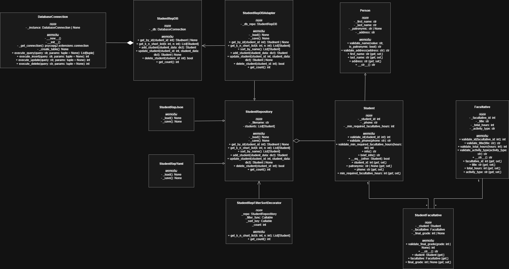

# Учебный проект по дисциплине "Проектирование информационных систем"

## Лабораторная работа 1
В этой работе были научились создавать классы, разобрались с принципами ООП. Итогом работы стало создание класса Student, который будет использоваться в дальнейших работах

## Лабораторная работа 2
Создание класса репозитория для класса Student. Различная реализация репозиториев (json, yaml, PostgreSQL), применение паттернов Адаптер, Одиночка и Декоратор.

### Диаграмма классов

